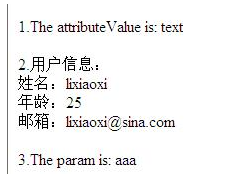

# SpringBoot笔记

## 概述

### 环境要求

- Java8及以上
- Maven 3.3及以上

- springboot 2.2.9+ ，大部分案例采用 2.4.3版本
- IDEA2020

### 学习资料

- [Spring Boot官网](https://spring.io/projects/spring-boot)
- [Spring Boot官方文档](https://docs.spring.io/spring-boot/docs/)
- [我的文档语雀地址](https://www.yuque.com/yuquexiongjt/qh2h6g/hf9ttt)

- [B站尚硅谷雷丰阳视频地址](https://www.bilibili.com/video/BV19K4y1L7MT?p=1)
- [狂神说Java](https://space.bilibili.com/95256449/)
- [编程不良人](https://space.bilibili.com/352224540/)
- [江南一点雨](https://space.bilibili.com/49484631/?spm_id_from=333.999.0.0)

## 在IDEA中实现SpringBoot项目热部署

#### 1、开启IDEA的自动编译（静态）

具体步骤：打开顶部工具栏  File -> Settings -> Default Settings -> Build -> Compiler  然后勾选 Build project automatically 。


#### 2、开启IDEA的自动编译（动态）

具体步骤：同时按住 Ctrl + Shift + Alt + /  然后进入Registry ，勾选自动编译并调整延时参数。

- compiler.automake.allow.when.app.running   -> 自动编译
- compile.document.save.trigger.delay  -> 自动更新文件

PS：网上极少有人提到compile.document.save.trigger.delay 它主要是针对静态文件如JS CSS的更新，将延迟时间减少后，直接按F5刷新页面就能看到效果！


#### 3、开启IDEA的热部署策略（非常重要）

具体步骤：顶部菜单- >Edit Configurations->SpringBoot插件->目标项目->勾选热更新。


#### 4、在项目添加热部署插件（可选）

> 温馨提示：
>  如果因为旧项目十分臃肿，导致每次都自动热重启很慢而影响开发效率，笔者建议直接在POM移除`spring-boot-devtools`依赖，然后使用Control+Shift+F9进行手工免启动快速更新！！

具体步骤：在POM文件添加热部署插件


#### 5、关闭浏览器缓存（重要）

打开谷歌浏览器，打开F12的Network选项栏，然后勾选【✅】Disable cache 。


## SpringBoot加载顺序


@Order(num)		//加载顺序 num数字越小 优先级越高

加载顺序打印

```shell
Java HotSpot(TM) 64-Bit Server VM warning: Options -Xverify:none and -noverify were deprecated in JDK 13 and will likely be removed in a future release.
The service to start.

  .   ____          _            __ _ _
 /\\ / ___'_ __ _ _(_)_ __  __ _ \ \ \ \
( ( )\___ | '_ | '_| | '_ \/ _` | \ \ \ \
 \\/  ___)| |_)| | | | | || (_| |  ) ) ) )
  '  |____| .__|_| |_|_| |_\__, | / / / /
 =========|_|==============|___/=/_/_/_/
 :: Spring Boot ::                (v2.4.3)

2022-02-08 11:00:34.993  INFO 13164 --- [           main] com.neo.CommandLineRunnerApplication     : 
...
2022-02-08 11:00:36.407  INFO 13164 --- [           main] o.s.b.w.embedded.tomcat.TomcatWebServer  : Tomcat started on port(s): 8080 (http) with context path ''
2022-02-08 11:00:36.419  INFO 13164 --- [           main] com.neo.CommandLineRunnerApplication     : Started CommandLineRunnerApplication in 1.929 seconds (JVM running for 3.343)
The OrderRunner1 start to initialize ...
The OrderRunner2 start to initialize ...
The Runner start to initialize ...
The service has started.
```

## SpringBoot自动装配原理


### VBlog上传到GitHub项目

https://github.com/lenve/VBlog


vue项目不上传的文件和目录


springboot项目不上传的文件和文件夹


## SpringBoot事务管理

SpringBoot 使用事务非常简单，底层依然采用的是Spring本身提供的事务管理

• 在入口类中使用注解 @EnableTransactionManagement 开启事务支持

• 在访问数据库的Service方法上添加注解 @Transactional 即可

**案例思路**

通过SpringBoot +MyBatis实现对数据库学生表的更新操作，在service层的方法中构建异常，查看事务是否生效；

项目名称：012-springboot-web-mybatis-transacation

该项目是在011的基础上添加新增方法，在新增方法中进行案例的演示。

**实现步骤**

1）在StudentController中添加更新学生的方法

```java
@Controller
public class SpringBootController {

    @Autowired
    private StudentService studentService;

    @RequestMapping(value = "/springBoot/update")
    public @ResponseBody Object update() {
        Student student = new Student();
        student.setId(1);
        student.setName("Mark");
        student.setAge(100);

        int updateCount = studentService.update(student);

        return updateCount;
    }
}
```

2）在StudentService接口中添加更新学生方法

```java
public interface StudentService {
    int update(Student student);
}
```

3）在StudentServiceImpl接口实现类中对更新学生方法进行实现，并构建一个异常，同时在该方法上加@Transactional注解

```java
@Override
@Transactional //添加此注解说明该方法添加的事务管理
public int update(Student student) {

    int updateCount = studentMapper.updateByPrimaryKeySelective(student);

    System.out.println("更新结果：" + updateCount);

    //在此构造一个除数为0的异常，测试事务是否起作用
    int a = 10/0;

    return updateCount;
}
```

4）在Application类上加@EnableTransactionManagement开启事务支持

==@EnableTransactionManagement可选，但是@Service必须添加事务才生效==

```java
@SpringBootApplication
@EnableTransactionManagement 		//SpringBoot开启事务的支持
public class Application {
    public static void main(String[] args) {
        SpringApplication.run(Application.class, args);
    }
}
```

5）启动Application，通过浏览器访问进行测试

浏览器


IDEA控制台


数据库表


通过以上结果，说明事务起作用了。

6）注释掉StudentServiceImpl上的@Transactional测试

数据库的数据被更新


## SpringBoot中SpringMVC注解

参考：https://www.cnblogs.com/cjeandailynotes/p/10469377.html

SpringBoot中的SpringMVC和之前的SpringMVC框架使用是完全一样的，主要有以下注解：

#### 1、@Controller

SpringMVC的注解，处理http请求，一般放在xxxController.java   类的上面

#### 2、@RestController

Spring4后新增注解，是@Controller注解功能的增强，是@Controller与@ResponseBody的组合注解；

如果一个Controller类添加了@RestController，那么该Controller类下的所有方法都相当于添加了@ResponseBody注解；

用于返回字符串或json数据。

#### 3、@RequestMapping

RequestMapping是一个用来处理请求地址映射的注解（将请求映射到对应的控制器方法中），可用于类或方法上。用于类上，表示类中

的所有响应请求的方法都是以该地址作为父路径。

RequestMapping请求路径映射，如果标注在某个controller的类级别上，则表明访问此类路径下的方法都要加上其配置的路径；标注在

方法上，表明哪个具体的方法来接受处理某次请求。

```java
@Controller
@RequestMapping(value="/book")
public class BookController {
    @RequestMapping(value="/title")
    public String getTitle(){
        return "title";
    }           
    
    @RequestMapping(value="/content")
    public String getContent(){
        return "content";
    } 
} 
```

由于BookController类加了value="/book"的@RequestMapping的注解，所以相关路径都要加上"/book"，即请求的url分别为：

(1)http://localhost:8080/book/title 

(2)http://localhost:8080/book/content

"@RequestMapping"的value值前后是否有“/”对请求的路径没有影响，即value="book" 、"/book"、"/book/"其效果是一样的。

SpringMVC提供了常用的请求方法注解，即指定请求方法的@RequestMapping

> @GetMapping
>
> RequestMapping和Get请求方法的组合只支持Get请求；Get请求主要用于查询操作。
>
> @PostMapping
>
> RequestMapping和Post请求方法的组合只支持Post请求；Post请求主要用户新增数据。
>
> @PutMapping
>
> RequestMapping和Put请求方法的组合只支持Put请求；Put通常用于修改数据。
>
> @DeleteMapping
>
> RequestMapping 和 Delete请求方法的组合只支持Delete请求；通常用于删除数据。

**@RequestMapping()的所有属性：**

```java
//这三个参数是一样的，都是匹配路由
String name() default "";

@AliasFor("path")
String[] value() default {};

@AliasFor("value")
String[] path() default {};

//请求方法
RequestMethod[] method() default {};
	//@RequestMapping(value = "/hello",method = RequestMethod.POST)

//请求参数
String[] params() default {};

//请求头
String[] headers() default {};
	//@RequestMapping(value = "/something", headers = "content-type=text/*")
    //will match requests with a Content-Type of "text/html", "text/plain", etc


String[] consumes() default {};

String[] produces() default {};
```

**value：指定请求的实际url**
(1)普通的具体值

如 value="/book"。

(2)含某变量的一类值

```java
@RequestMapping(value="/get/{bookId}")
public String getBookById(@PathVariable String bookId,Model model){
    model.addAttribute("bookId", bookId);
    return "book";
} 
```

路径中的bookId可以当变量，@PathVariable注解即提取路径中的变量值。

(3)ant风格

```java
//可匹配“/get/id1”或“/get/ida”，但不匹配“/get/id”或“/get/idaa”;
@RequestMapping(value="/get/id?")

//可匹配“/get/idabc”或“/get/id”，但不匹配“/get/idabc/abc”;
@RequestMapping(value="/get/id*")

//可匹配“/get/id/abc”，但不匹配“/get/idabc”;
@RequestMapping(value="/get/id/*")

//可匹配“/get/id/abc/abc/123”或“/get/id/123”，也就是Ant风格和URI模板变量风格可混用。
@RequestMapping(value="/get/id/**/{id}")
```

(4)含正则表达式的一类值

```java
//：可以匹配“/get/123-1”，但不能匹配“/get/abc-1”，这样可以设计更加严格的规则
@RequestMapping(value="/get/{idPre:\\d+}-{idNum:\\d+}")
//可以通过@PathVariable 注解提取路径中的变量(idPre,idNum)
```

(5)或关系

```java
//即 /getAll或/fetchAll都会映射到该方法上。
@RequestMapping(value={"/getAll","/fetchAll"} )
```

**method：指定请求的method类型， GET、POST、PUT、DELETE等；**
@RequestMapping(value="/get/{bookid}",method={RequestMethod.GET,RequestMethod.POST})

**params：指定request中必须包含某些参数值时才让该方法处理。**

```java
//请求参数包含“action=del”,如：http://localhost:8080/book?action=del
@RequestMapping(params="action=del")


@Controller
@RequestMapping("/owners/{ownerId}")
public class RelativePathUriTemplateController {
    
	//仅处理请求中包含了名为“myParam”，值为“myValue”的请求。
    @RequestMapping(value = "/pets/{petId}", method = RequestMethod.GET, params="myParam=myValue")
    public void findPet(@PathVariable String ownerId, @PathVariable String petId, Model model) {    
        // implementation omitted
    }
}
```

**headers：指定request中必须包含某些指定的header值，才能让该方法处理请求。**
@RequestMapping(value="/header/id", headers = "Accept=application/json")：表示请求的URL必须为“/header/id 且请求头中必须有“Accept =application/json”参数即可匹配。

```java
@Controller
@RequestMapping("/owners/{ownerId}")
public class RelativePathUriTemplateController {

@RequestMapping(value = "/pets", method = RequestMethod.GET, headers="Referer=http://www.ifeng.com/")
  public void findPet(@PathVariable String ownerId, @PathVariable String petId, Model model) {    
    // implementation omitted
  }
}
```

仅处理request的header中包含了指定“Refer”请求头和对应值为“`http://www.ifeng.com/`”的请求。

**consumes：指定处理请求的提交内容类型（Content-Type），例如application/json, text/html。**

```java
@Controller
@RequestMapping(value = "/pets", method = RequestMethod.POST, consumes="application/json")
public void addPet(@RequestBody Pet pet, Model model) {    
    // implementation omitted
}
```

 方法仅处理request Content-Type为“application/json”类型的请求。
**produces: 指定返回的内容类型，仅当request请求头中的(Accept)类型中包含该指定类型才返回。** 

```java
@Controller
@RequestMapping(value = "/pets/{petId}", method = RequestMethod.GET, produces="application/json")
@ResponseBody
public Pet getPet(@PathVariable String petId, Model model) {    
    // implementation omitted
}
```

方法仅处理request请求中Accept头中包含了"application/json"的请求，同时暗示了返回的内容类型为application/json;

#### 4、@RequestParam绑定单个请求参数值

@RequestParam用于将请求参数区数据映射到功能处理方法的参数上。

```java
public String requestparam1(@RequestParam String username)
```

请求中包含username参数（如/requestparam1?username=zhang）

@RequestParam有以下三个参数：

value：参数名字，即入参的请求参数名字，如username表示请求的参数区中的名字为username的参数的值将传入；

required：是否必须，默认是true，表示请求中一定要有相应的参数，否则将抛出异常；

defaultValue：默认值，表示如果请求中没有同名参数时的默认值，设置该参数时，自动将required设为false。

```java
public String requestparam4(@RequestParam(value="username",required=false) String username)
```

表示请求中可以没有名字为username的参数，如果没有默认为null，此处需要注意如下几点：

原子类型：必须有值，否则抛出异常，如果允许空值请使用包装类代替。

Boolean包装类型：默认Boolean.FALSE，其他引用类型默认为null。

如果请求中有多个同名的应该如何接收呢？如给用户授权时，可能授予多个权限，首先看下如下代码：

```java
public String requestparam7(@RequestParam(value="role") String roleList)
```

如果请求参数类似于url?role=admin&rule=user，则实际roleList参数入参的数据为“admin,user”，即多个数据之间使用 “,” 分割；我们应

该使用如下方式来接收多个请求参数：

```java
public String requestparam7(@RequestParam(value="role") String[] roleList)
```

或者

```java
public String requestparam8(@RequestParam(value="list") List<String> list)  
```

#### 5、@PathVariable绑定URI模板变量值

@PathVariable用于将请求URL中的模板变量映射到功能处理方法的参数上。

```java
@RequestMapping(value="/users/{userId}/topics/{topicId}")
public String test(
       @PathVariable(value="userId") int userId, 
       @PathVariable(value="topicId") int topicId){
    ...
}
```

如请求的URL为 “/users/123/topics/456”，则自动将URL中模板变量{userId}和{topicId}绑定到通过@PathVariable注解的同名参数上，

即入参后userId=123、topicId=456。

#### 6、@ModelAttribute

ModelAttribute可以应用在方法参数上或方法上，他的作用主要是当注解在方法参数上时会将注解的参数对象添加到Model中；当注解在

请求处理方法Action上时会将该方法变成一个非请求处理的方法，但其它Action被调用时会首先调用该方法。

**6.1 @ModelAttribute注释一个方法**

被@ModelAttribute注释的方法表示这个方法的目的是增加一个或多个模型(model)属性。这个方法和被@RequestMapping注释的方法

一样也支持@RequestParam参数，但是它不能直接被请求映射。实际上，控制器中的@ModelAttribute方法是在同一控制器中的

@RequestMapping方法被调用之前调用的。

被@ModelAttribute注释的方法用于填充model属性，例如，为下拉菜单填充内容，或检索一个command对象（如，Account），用它

来表示一个HTML表单中的数据。

一个控制器可以有任意数量的@ModelAttribute方法。所有这些方法都在@RequestMapping方法被调用之前调用。

有两种类型的@ModelAttribute方法。一种是：只加入一个属性，用方法的返回类型隐含表示。另一种是：方法接受一个Model类型的参

数，这个model可以加入任意多个model属性。

**(1)@ModelAttribute注释void返回值的方法**

```java
@Controller
@RequestMapping(value="/test")
public class TestController {
    
    /**
     * 1.@ModelAttribute注释void返回值的方法
      * @param abc
     * @param model
     */
    @ModelAttribute
    public void populateModel(@RequestParam String abc, Model model) {
        model.addAttribute("attributeName", abc);
    }
    
    @RequestMapping(value = "/helloWorld")
    public String helloWorld() {
       return "test/helloWorld";
    }
}
```

这个例子，在获得请求/helloWorld 后，populateModel方法在helloWorld方法之前先被调用，它把请求参数（/helloWorld?abc=text）

加入到一个名为attributeName的model属性中，在它执行后helloWorld被调用，返回视图名helloWorld和model已由@ModelAttribute

方法生产好了。这个例子中model属性名称和model属性对象由model.addAttribute()实现，不过前提是要在方法中加入一个Model类型

的参数。

**(2)@ModelAttribute注释返回具体类的方法**

```java
/**
 * 2.@ModelAttribute注释返回具体类的方法
 * @param id
 * @return
 */
@ModelAttribute
public User getUserInfo(String id){
    if(id!=null && !id.equals("")){
        return userService.getUserInfo(id);
    }
    return null;
}
```

这种情况，model属性的名称没有指定，它由返回类型隐含表示，如这个方法返回User类型，那么这个model属性的名称是user。
这个例子中model属性名称有返回对象类型隐含表示，model属性对象就是方法的返回值。它无须要特定的参数。

**(3)@ModelAttribute(value="")注释返回具体类的方法**

```java
@Controller
@RequestMapping(value="/test")
public class TestController {
    
    /**
     * 3.@ModelAttribute(value="")注释返回具体类的方法
      * @param abc
     * @return
     */
    @ModelAttribute("str")
    public String getParam(@RequestParam String param) {
        return param;
    }
    
    @RequestMapping(value = "/helloWorld")
    public String helloWorld() {
       return "test/helloWorld";
    }
}
```

这个例子中使用@ModelAttribute注释的value属性，来指定model属性的名称。model属性对象就是方法的返回值。它无须要特定的参数。

完整的代码：

```java
package demo.controller;

import org.springframework.beans.factory.annotation.Autowired;
import org.springframework.stereotype.Controller;
import org.springframework.ui.Model;
import org.springframework.web.bind.annotation.ModelAttribute;
import org.springframework.web.bind.annotation.RequestMapping;
import org.springframework.web.bind.annotation.RequestParam;

import demo.model.User;
import demo.service.IUserService;

@Controller
@RequestMapping(value="/test")
public class TestController {
    
    @Autowired
    private IUserService userService;
    
    /**
     * 1.@ModelAttribute注释void返回值的方法
      * @param abc
     * @param model
     */
    @ModelAttribute
    public void populateModel(@RequestParam String abc, Model model) {
        model.addAttribute("attributeName", abc);
    }
    
    /**
     * 2.@ModelAttribute注释返回具体类的方法
      * @param id
     * @return
     */
    @ModelAttribute
    public User getUserInfo(String id){
        if(id!=null && !id.equals("")){
            return userService.getUserInfo(id);
        }
        return null;
    }
    
    /**
     * 3.@ModelAttribute(value="")注释返回具体类的方法
      * @param abc
     * @return
     */
    @ModelAttribute("str")
    public String getParam(@RequestParam String param) {
        return param;
    }
    
    @RequestMapping(value = "/helloWorld")
    public String helloWorld() {
       return "test/helloWorld";
    }
}
```

Jsp前台取值：

```jsp
<%@ page language="java" import="java.util.*" pageEncoding="utf-8"%>
<%
String path = request.getContextPath();
String basePath = request.getScheme()+"://"+request.getServerName()+":"+request.getServerPort()+path+"/";
%>

<!DOCTYPE HTML PUBLIC "-//W3C//DTD HTML 4.01 Transitional//EN">
<html>
  <head> 
    <title>helloWorld</title>
  </head>
  
  <body>
       1.The attributeValue is:  ${attributeName}
       <br/><br/>
       
       2.用户信息：<br/>
       姓名：${user.user_name}<br/>
       年龄：${user.user_age}<br/>
       邮箱：${user.user_email}<br/><br/>
      
      3.The param is:  ${str}
  </body>
</html>
```

页面效果图：



URL格式：http://localhost/SSMDemo/test/helloWorld?abc=text&id=1&param=aaa 注：当url或者post中不包含参数abc和参数param时，会报错。

**(4)@ModelAttribute和@RequestMapping同时注释一个方法**

```java
@Controller
@RequestMapping(value="/test")
public class TestController {

    @RequestMapping(value = "/helloWorld")
    @ModelAttribute("attributeName")
    public String helloWorld() {
       return "hi";
    }
}
```

这时这个方法的返回值并不是表示一个视图名称，而是model属性的值，视图名称由RequestToViewNameTranslator根据请求"/helloWorld"转换为helloWorld。Model属性名称由@ModelAttribute(value=””)指定，相当于在request中封装了key=attributeName，value=hi。

Jsp页面：

```jsp
<!DOCTYPE HTML PUBLIC "-//W3C//DTD HTML 4.01 Transitional//EN">
<html>
  <head> 
    <title>helloWorld</title>
  </head>
  
  <body>
      The attributeValue is:  ${attributeName}
  </body>
</html>
```

 **4.2 @ModelAttribute注释一个方法的参数**

@ModelAttribute注释方法的一个参数表示应从模型model中取得。若在model中未找到，那么这个参数将先被实例化后加入到model中。若在model中找到，则请求参数名称和model属性字段若相匹配就会自动填充。这个机制对于表单提交数据绑定到对象属性上很有效。

当@ModelAttribute注解用于方法参数时，它有了双重功能，即“存/取”。首先，它从模型中取出数据并赋予对应的参数，如果模型中尚不存在，则实例化一个，并存放于模型中；其次，一旦模型中已存在此数据对象，接下来一个很重要的步骤便是将请求参数绑定到此对象上（请求参数名映射对象属性名），这是Spring MVC提供的一个非常便利的机制--数据绑定。

```java
@RequestMapping(value = "/login.htm", method = RequestMethod.GET)
public String doLogin(@ModelAttribute("baseMember") BaseMember member) {
    member.setLoginName("loginName");
    return "home";
}
```

上述代码中，如果模型中尚不存在键名为“baseMember”的数据，则首先会调用BaseMember类的默认构造器创建一个对象，如果不存在默认构造器会抛出异常。因此，给实体类提供一个默认构造器是一个好的编程习惯。当请求路径的请求参数或提交的表单与BaseMember的属性名匹配时，将自动将其值绑定到baseMember对象中，非常的便利！这可能是我们使用@ModelAttribute最主要的原因之一。比如：请求路径为[http://localhost:8080/spring-web/login.htm?loginName=myLoginName](http://localhost:8080/spring-web/login2.htm?loginName=myLoginName)，baseMember对象中的loginName属性的值将被设置为myLoginName。

**4.3 @ModelAttribute注解的使用场景** 
当@ModelAttribute注解用于方法时，与其处于同一个处理类的所有请求方法执行前都会执行一次此方法，这可能并不是我们想要的，因

此，我们使用更多的是将其应用在请求方法的参数上，而它的一部分功能与@RequestParam注解是一致的，只不过@RequestParam用

于绑定单个参数值，而@ModelAttribute注解可以绑定所有名称匹配的，此外它自动将绑定后的数据添加到模型中，无形中也给我们提供

了便利，这也可能是它命名为ModelAttribute的原因。

#### 7、SessionAttributes

在默认情况下，ModelMap中的属性作用域是request级别，也就是说，当本次请求结束后，ModelMap 中的属性将销毁。如果希望在多个请求中共享ModelMap中的属性，必须将其属性转存到session 中，这样 ModelMap 的属性才可以被跨请求访问。
Spring 允许我们有选择地指定 ModelMap 中的哪些属性需要转存到 session 中，以便下一个请求属对应的 ModelMap 的属性列表中还能访问到这些属性。这一功能是通过类定义处标注 @SessionAttributes 注解来实现的。

```java
package demo.controller;

import org.springframework.stereotype.Controller;
import org.springframework.ui.ModelMap;
import org.springframework.web.bind.annotation.RequestMapping;
import org.springframework.web.bind.annotation.SessionAttributes;

import demo.model.User;

@Controller
@RequestMapping(value="/demo1")
//(1)将ModelMap中属性名为currUser的属性放到Session属性列表中，以便这个属性可以跨请求访问
@SessionAttributes("currUser")
public class Demo1Controller {
    
    @RequestMapping(value="/getUser")
    public String getUser(ModelMap model){
        User user=new User();
        user.setUser_name("zhangsan");
        user.setUser_age(25);
        user.setUser_email("zhangsan@sina.com");
        //(2)向ModelMap中添加一个属性
         model.addAttribute("currUser",user);
        return "/demo/user";
    }
    
    @RequestMapping(value="/getUser1")
    public String getUser1(ModelMap model){
        User user=(User)model.get("currUser");
        System.out.println(user.getUser_name());
        System.out.println(user.getUser_age());
        System.out.println(user.getUser_email());
        return "demo/user1";
    }
}
```

我们在(2)处添加了一个 ModelMap 属性，其属性名为 currUser，而(1)处通过 @SessionAttributes 注解将 ModelMap 中名为 currUser 的属性放置到 Session 中，所以我们不但可以在 getUser() 请求所对应的 JSP 视图页面中通过 request.getAttribute(“currUser”) 和 session.getAttribute(“currUser”) 获取 user 对象，还可以在下一个请求(getUser1())所对应的 JSP 视图页面中通过 session.getAttribute(“currUser”) 或 session.getAttribute(“currUser”)访问到这个属性。

 这里我们仅将一个 ModelMap 的属性放入 Session 中，其实 @SessionAttributes 允许指定多个属性。你可以通过字符串数组的方式指定多个属性，如 @SessionAttributes({“attr1”,"attr2”})。此外，@SessionAttributes 还可以通过属性类型指定要 session 化的 ModelMap 属性，如 @SessionAttributes(types = User.class)，当然也可以指定多个类，如 @SessionAttributes(types = {User.class,Dept.class})，还可以联合使用属性名和属性类型指定：@SessionAttributes(types = {User.class,Dept.class},value={“attr1”,"attr2”})。

user.jsp页面：

```jsp
<%@ page language="java" import="java.util.*" pageEncoding="utf-8"%>
<%@ page import="demo.model.User" %>
<%
String path = request.getContextPath();
String basePath = request.getScheme()+"://"+request.getServerName()+":"+request.getServerPort()+path+"/";
%>

<!DOCTYPE HTML PUBLIC "-//W3C//DTD HTML 4.01 Transitional//EN">
<html>
  <head>
    <base href="<%=basePath%>">
    <title>My JSP 'index.jsp' starting page</title>
  </head>
  <body><br>
      <%User user=(User)session.getAttribute("currUser");%>
      用户名：<%=user.getUser_name() %><br/>
      年龄：<%=user.getUser_age() %><br/>
      邮箱：<%=user.getUser_email() %><br/><br/>
      <a href="<%=path %>/demo1/getUser1">跳转</a>
  </body>
</html>
```

 **通过@ModelAttribute绑定**

**@SessionAttributes 是用来在 controller 内部共享 model 属性的。**我们可以在需要访问 Session 属性的 controller 上加上 @SessionAttributes，然后在 action 需要的 User 参数上加上 @ModelAttribute，并保证两者的属性名称一致。SpringMVC 就会自动将 @SessionAttributes 定义的属性注入到 ModelMap 对象，在 setup action 的参数列表时，去 ModelMap 中取到这样的对象，再添加到参数列表。只要我们不去调用 SessionStatus 的 setComplete() 方法，这个对象就会一直保留在 Session 中，从而实现 Session 信息的共享。

```java
@Controller  
@SessionAttributes("currentUser")  
public class GreetingController{   
    @RequestMapping  
    public void hello(@ModelAttribute("currentUser") User user){   
    //user.sayHello()   
    }   
}
```

**@SessionAttributes清除**
@SessionAttributes需要清除时，使用SessionStatus.setComplete();来清除。注意，它只清除@SessionAttributes的session，不会清除HttpSession的数据。故如用户身份验证对象的session一般不用它来实现，还是用session.setAttribute等传统的方式实现。

#### 8、@Responsebody与@RequestBody

@Responsebody表示该方法的返回结果直接写入HTTP response body中。一般在异步获取数据时使用，在使用@RequestMapping后，返回值通常解析为跳转路径，加上@Responsebody后返回结果不会被解析为跳转路径，而是直接写入HTTP response body中。比如异步获取json数据，加上@Responsebody后，会直接返回json数据。
@RequestBody将HTTP请求正文插入方法中,使用适合的HttpMessageConverter将请求体写入某个对象。

```js
$("#btn2").click(function(){
    var url='<%=request.getContextPath()%>/User/addUserInfo';
    var data={"user_name":$("#userName").val(),"user_sex":$("#userSex").val(),"user_age":$("#userAge").val(),
    "user_email":$("#userEmail").val(),"user_telephone":$("#userTelephone").val(),"user_education":$("#userEducation").val(),
    "user_title":$("#userTitle").val()};   

     $.ajax({
       type:'POST',
       contentType : 'application/json',   
      url:url,
      dataType:"json",
      data:JSON.stringify(data),
      async:false,
      success:function(data){
          alert("新增成功！");      
      },
      error: function(XMLHttpRequest, textStatus, errorThrown){
           alert(XMLHttpRequest.status);
           alert(XMLHttpRequest.readyState);
           alert(textStatus);
      }
    })
})
```

java代码

```java
@RequestMapping(value="/addUserInfo",method=RequestMethod.POST)
@ResponseBody
 //将请求中的data写入UserModel对象中
public String addUserInfo(@RequestBody UserModel user){
    System.out.println("user_name--------"+user.getUser_name());
    System.out.println("user_sex--------"+user.getUser_sex());
    System.out.println("user_age--------"+user.getUser_age());
    System.out.println("user_email--------"+user.getUser_email());
    System.out.println("user_title--------"+user.getUser_title());
    System.out.println("user_education--------"+user.getUser_education());
    System.out.println("user_telephone--------"+user.getUser_telephone());
    //不会被解析为跳转路径，而是直接写入HTTP response body中
    return "{}";
}
```

**@RequestBody 将HTTP请求正文转换为适合的HttpMessageConverter对象。**

**@RequestBody**

> 作用： 
>  i) 该注解用于读取Request请求的body部分数据，使用系统默认配置的HttpMessageConverter进行解析，然后把相应的数据绑定到要返回的对象上；
>  ii) 再把HttpMessageConverter返回的对象数据绑定到 controller中方法的参数上。
> 使用时机：
> A) GET、POST方式提时， 根据request header Content-Type的值来判断:
> application/x-www-form-urlencoded， 可选（即非必须，因为这种情况的数据@RequestParam, @ModelAttribute也可以处理，当然@RequestBody也能处理）；
> multipart/form-data, 不能处理（即使用@RequestBody不能处理这种格式的数据）；
> 其他格式， 必须（其他格式包括application/json, application/xml等。这些格式的数据，必须使用@RequestBody来处理）；
>
> B) PUT方式提交时， 根据request header Content-Type的值来判断:
> application/x-www-form-urlencoded， 必须；
> multipart/form-data, 不能处理；
> 其他格式， 必须；
> 说明：request的body部分的数据编码格式由header部分的Content-Type指定；

**@ResponseBody**

**@ResponseBody 将内容或对象作为 HTTP 响应正文返回，并调用适合HttpMessageConverter的Adapter转换对象，写入输出流。**

> 作用： 
>  该注解用于将Controller的方法返回的对象，通过适当的HttpMessageConverter转换为指定格式后，写入到Response对象的body数据区。
> 使用时机：
>  返回的数据不是html标签的页面，而是其他某种格式的数据时（如json、xml等）使用；

## SpringBoot集成Redis缓存

http://www.bjpowernode.com/tutorial_springboot/831.html

```xml
#配置pom.xml
<dependency>
    <groupId>com.alibaba</groupId>
    <artifactId>fastjson</artifactId>
    <version>1.2.76</version>
</dependency>

<dependency>
    <groupId>org.springframework.boot</groupId>
    <artifactId>spring-boot-starter-data-redis</artifactId>
</dependency>

#核心配置文件
#配置redis连接信息(单机模式)
spring.redis.host=localhost
spring.redis.port=6379
```

service文件

```java
@Autowired
private StudentMapper studentMapper;

@Autowired
private RedisTemplate redisTemplate;

@Override
public RespBean getAllStudent() {
    List<TStudent> studentList = null;
    Object arr = redisTemplate.opsForValue().get("studentList");
    System.out.println(arr);

    if(ObjectUtils.isEmpty(arr) || arr == null || arr == "null"){
        System.out.println("===============>查询数据库");
        studentList = studentMapper.selectList(null);
        redisTemplate.opsForValue().set("studentList", JSON.toJSONString(studentList),15, TimeUnit.SECONDS);

        return RespBean.ok("ok",studentList);
    }

    System.out.println("===============>从redis缓存中取值");
    return RespBean.ok("ok",JSON.parse((String)arr));
}
```

## SpringBoot集成Dubbo

http://www.bjpowernode.com/tutorial_springboot/832.html

## 获取Spring容器

#### 1、SpringApplication.run()方法返回的Spring容器对象


代码：

```java
@SpringBootApplication
public class NotwebappApplication {
    public static void main(String[] args) {
        //方式一：SpringApplication.run()方法返回的ConfigurableApplicationContext是Spring容器的实现类
        ConfigurableApplicationContext context = SpringApplication.run(NotwebappApplication.class, args);

        StudentService studentService = (StudentService) context.getBean("studentServiceImpl");
        String ss = studentService.sayHello();
        System.out.println(ss);
    }
}
```

ConfigurableApplicationContext.java关系图


#### 2、Springboot的入口类实现CommandLineRunner接口

```java
@SpringBootApplication
public class NotwebappApplication implements CommandLineRunner {
    //第二步：通过容器获取bean，并注入给userService
    @Autowired
    public StudentService studentService;

    public static void main(String[] args) {
        //第一步：SpringBoot的启动程序，会初始化spring容器
        SpringApplication.run(NotwebappApplication.class, args);
    }

    //覆盖接口中的run方法
    @Override
    public void run(String... args) throws Exception {
        //第三步：容器启动后调用run方法，在该方法中调用业务方法
        String s = studentService.sayHello();
        System.out.println(s);
    }
}
```

## SpringBoot拦截器

参考：http://www.bjpowernode.com/tutorial_springboot/838.html

**1、实现一个拦截器（实现HandlerInterceptor）**

```java
public class MyInterceptor implements HandlerInterceptor {
    @Override
    public boolean preHandle(HttpServletRequest request, HttpServletResponse response, Object handler) throws Exception {
        System.out.println("执行MyInterceptor.preHandle==============>");
        HashMap<String, String> loginUser = (HashMap<String, String>) request.getSession().getAttribute("login_user");

        if(ObjectUtils.isEmpty(loginUser)){
            response.sendRedirect(request.getContextPath()+"/springboot/login");
            //被拦截
            return false;
        }else{
            //通过
            return true;
        }
    }

    @Override
    public void postHandle(HttpServletRequest request, HttpServletResponse response, Object handler, ModelAndView modelAndView) throws Exception {
        System.out.println("执行MyInterceptor.postHandle--------------->");
    }

    @Override
    public void afterCompletion(HttpServletRequest request, HttpServletResponse response, Object handler, Exception ex) throws Exception {
        System.out.println("执行MyInterceptor.afterCompletion++++++++++++++++++++++++>");
    }
}
```

**2、通过配置类注册拦截器**

在项目中创建一个config包，创建一个配置类InterceptorConfig，并实现WebMvcConfigurer接口， 覆盖接口中的addInterceptors方法，并为该配置类添加@Configuration注解，标注此类为一个配置类，让Spring Boot 扫描到，这里的操作就相当于SpringMVC的注册拦截器 ，@Configuration就相当于一个applicationContext-mvc.xml。

```java
@Configuration
public class InterceptorConfig implements WebMvcConfigurer {
    //定义需要拦截的路径
    String [] addPathPatterns = {
            "/springboot/**"
    };

    //定义不需要拦截的路径
    String [] excludePathPatterns = {
            "/test/**",
            "/springboot/login",
            "/springboot/doLogin",
            "/springboot/register",
            "/springboot/doRegister",
    };

    @Override
    public void addInterceptors(InterceptorRegistry registry) {
        registry.addInterceptor(new MyInterceptor())
                .addPathPatterns(addPathPatterns)
                .excludePathPatterns(excludePathPatterns);
    }
}

```

3、测试

1）直接输入  http://localhost:8080/springboot/hello  会跳转到登录页面http://localhost:8080/springboot/login

2）访问 http://localhost:8080/springboot/login

输入用户名密码登录


3）登录成功后再访问 http://localhost:8080/springboot/hello

控制台打印：

```shell
执行MyInterceptor.preHandle==============>
执行MyInterceptor.postHandle--------------->
执行MyInterceptor.afterCompletion++++++++++++++++++++++++>
```

## SpringMVC请求转发和重定向

参考：https://www.icode9.com/content-4-825109.html

**1、转发**

方式一：使用 “forword” 关键字（不是指java关键字），注意：类的注解不能使用@RestController 要用@Controller

```java
@RequestMapping(value="/test/test01/{name}" , method = RequestMethod.GET)
public String test(@PathVariable String name) {
    return "forword:/ceng/hello.html";
}
```

方式二：使用servlet 提供的API，注意：类的注解可以使用@RestController,也可以使用@Controller

```java
@RequestMapping(value="/test/test01/{name}" , method = RequestMethod.GET)
public void test(@PathVariable String name, HttpServletRequest request, HttpServletResponse response) throws Exception {
    request.getRequestDispatcher("/ceng/hello.html").forward(request,response);
}
```

**2、重定向**

方式一：使用 “redirect” 关键字（不是指java关键字），注意：类的注解不能使用@RestController，要用@Controller

```java
@RequestMapping(value="/test/test01/{name}" , method = RequestMethod.GET)
public String test(@PathVariable String name) {
    return "redirect:/ceng/hello.html";
}
```

方式二：使用servlet 提供的API，注意：类的注解可以使用@RestController，也可以使用@Controller

```java
@RequestMapping(value="/test/test01/{name}" , method = RequestMethod.GET)
public void test(@PathVariable String name, HttpServletResponse response) throws IOException {
    response.sendRedirect("/ceng/hello.html");
}
```

*使用API进行重定向时，一般会在url之前加上：request.getContextPath()*

## SpringBoot整合Servlet的两种方式

http://www.bjpowernode.com/tutorial_springboot/839.html

## SpringBoot项目打war包

#### jar包和war包的介绍和区别

https://www.jianshu.com/p/3b5c45e8e5bd

#### 1、使用IEDA创建项目


将打包方式改为War，会在创建项目时生成ServletInitializer.java


#### 2、spring-boot-starter-web去除内嵌的tomcat依赖

pom.xml文件中要去掉spring-boot-starter-web内嵌的tomcat或者将tomcat依赖scope改为provide

```xml
<!-- 移除嵌入式tomcat插件 -->
<dependency>
　　<groupId>org.springframework.boot</groupId>
　　　　<artifactId>spring-boot-starter-web</artifactId>
　　　　<exclusions>
　　　　　　<exclusion>
　　　　　　　　<groupId>org.springframework.boot</groupId>
　　　　　　　　<artifactId>spring-boot-starter-tomcat</artifactId>
　　　　　　</exclusion>
　　　　</exclusions>
</dependency>

<!-- 或者-->
<dependency>
　　<groupId>org.springframework.boot</groupId>
　　<artifactId>spring-boot-starter-tomcat</artifactId>
　　<scope>provided</scope>
</dependency>
```

#### 3、SpringBootServletInitializer

继承org.springframework.boot.web.servlet.support.SpringBootServletInitializer，实现configure方法

为什么继承该类，SpringBootServletInitializer源码注释：

> ```
> Note that a WebApplicationInitializer is only needed if you are building a war file and
> deploying it. If you prefer to run an embedded web server then you won't need this at all.
> ```
>
> 请注意，WebApplicationInitializer 仅在您构建 war 文件并部署它时才需要。如果您更喜欢运行嵌入式 Web 服务器，那么您根本不需要它

启动类代码：

```java
@SpringBootApplication
public class DemoApplication {
    public static void main(String[] args) {
        SpringApplication.run(DemoApplication.class, args);
    }
}
```

方式一、启动类继承SpringBootServletInitializer实现configure：

```java
@SpringBootApplication
public class Application extends SpringBootServletInitializer {

    public static void main(String[] args) {
        SpringApplication.run(Application.class, args);
    }

    @Override
    protected SpringApplicationBuilder configure(SpringApplicationBuilder builder) {
        return builder.sources(Application.class);
    }
}
```

方式二、新增加一个类继承SpringBootServletInitializer实现configure：

```java
public class ServletInitializer extends SpringBootServletInitializer {
    @Override
    protected SpringApplicationBuilder configure(SpringApplicationBuilder builder) {
        //此处的Application.class为带有@SpringBootApplication注解的启动类
        return builder.sources(DemoApplication.class);
    }
}
```

#### 4、打包&部署

1、使用IDEA的Maven打包工具


**注意：**

> 使用外部Tomcat部署访问的时候，application.properties(或者application.yml)中配置的
>
> ```shell
> server.port=8888
> server.servlet.context-path=/springboot-jsp
> ```
>
> 将失效，请使用tomcat的端口，tomcat，webapps下项目名进行访问。
>
> 为了防止应用上下文所导致的项目访问资源加载不到的问题，建议pom.xml文件中`<build></build>`标签下添加`<finalName></finalName>`标签：
>
> 
>
> 使用IDEA的maven打包工具会将项目打包生成为： /tragetspringboot-jsp.war

2、将war包拷贝到tomcat服务器的webapps目录下，运行/bin/startup.bat


3、浏览器中输入：

http://localhost:[tomcat端口]/[war包名]/jsp/blog/list

http://localhost:8080/springboot-jsp/jsp/blog/list

## SpringBoot集成JSP

maven依赖

```xml
<?xml version="1.0" encoding="UTF-8"?>
<project xmlns="http://maven.apache.org/POM/4.0.0" xmlns:xsi="http://www.w3.org/2001/XMLSchema-instance"
         xsi:schemaLocation="http://maven.apache.org/POM/4.0.0 https://maven.apache.org/xsd/maven-4.0.0.xsd">
    <modelVersion>4.0.0</modelVersion>
    <parent>
        <groupId>org.springframework.boot</groupId>
        <artifactId>spring-boot-starter-parent</artifactId>
        <version>2.4.3</version>
        <relativePath/> <!-- lookup parent from repository -->
    </parent>

    <groupId>com.example.jsp</groupId>
    <artifactId>demo</artifactId>
    <version>0.0.1-SNAPSHOT</version>
    <packaging>war</packaging>			<!-- 打war包 -->
    <name>demo</name>
    <description>Demo project for Spring Boot</description>
    <properties>
        <java.version>1.8</java.version>
    </properties>

    <dependencies>
        <dependency>
            <groupId>org.springframework.boot</groupId>
            <artifactId>spring-boot-starter-web</artifactId>
        </dependency>

        <dependency>
            <groupId>org.springframework.boot</groupId>
            <artifactId>spring-boot-devtools</artifactId>
            <scope>runtime</scope>
            <optional>true</optional>
        </dependency>
        <dependency>
            <groupId>org.springframework.boot</groupId>
            <artifactId>spring-boot-configuration-processor</artifactId>
            <optional>true</optional>
        </dependency>
        <dependency>
            <groupId>org.projectlombok</groupId>
            <artifactId>lombok</artifactId>
            <optional>true</optional>
        </dependency>
        <dependency>
            <groupId>org.springframework.boot</groupId>
            <artifactId>spring-boot-starter-tomcat</artifactId>
            <scope>provided</scope>
        </dependency>
        <dependency>
            <groupId>org.springframework.boot</groupId>
            <artifactId>spring-boot-starter-test</artifactId>
            <scope>test</scope>
        </dependency>

        <!--jsp引擎(必须)-->
        <dependency>
            <groupId>org.apache.tomcat.embed</groupId>
            <artifactId>tomcat-embed-jasper</artifactId>
        </dependency>
        <dependency>
            <groupId>javax.servlet</groupId>
            <artifactId>jstl</artifactId>
        </dependency>
    </dependencies>

    <build>
        <plugins>
            <plugin>
                <groupId>org.springframework.boot</groupId>
                <artifactId>spring-boot-maven-plugin</artifactId>
                <configuration>
                    <excludes>
                        <exclude>
                            <groupId>org.projectlombok</groupId>
                            <artifactId>lombok</artifactId>
                        </exclude>
                    </excludes>
                </configuration>
            </plugin>
        </plugins>
    </build>

</project>
```

demo示例：


## SpringBoot集成Shiro

### Shiro注解

https://www.cnblogs.com/pingxin/p/p00115.html

## SpringBoot集成SpringSecurity

