# 阿里云对象存储OSS

## 环境搭建

### 1、开通阿里云对象存储

选择左上角的产品与服务，搜索对象存储

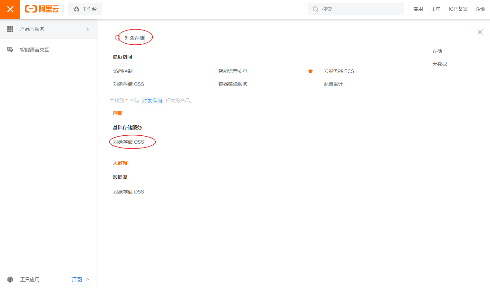

### 2、创建Bucket

入口

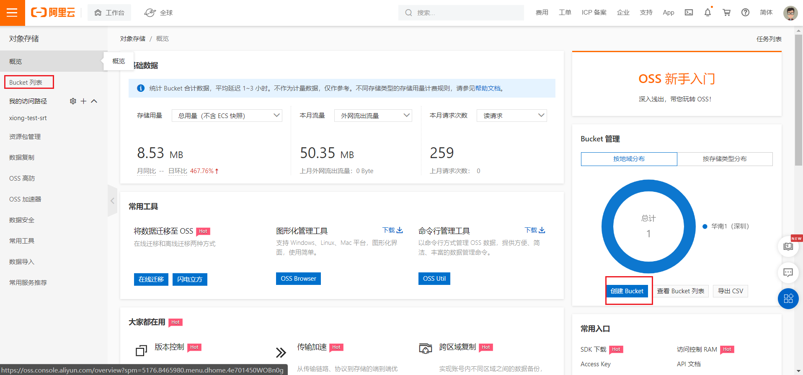

bucket信息

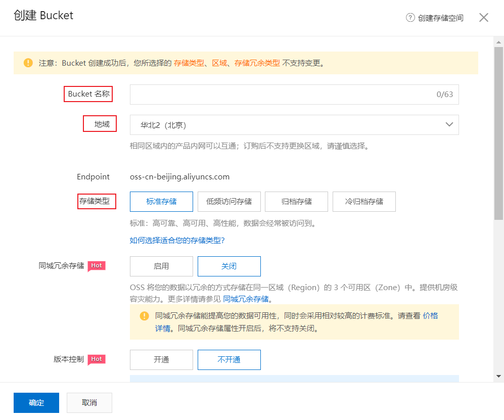

### 3、查看bucket文件

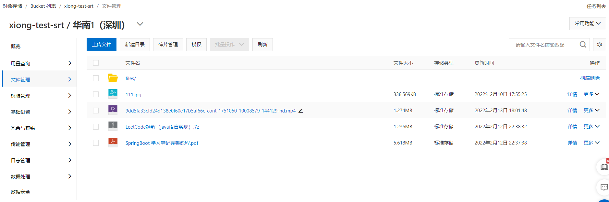

### 4、修改bucket配置信息

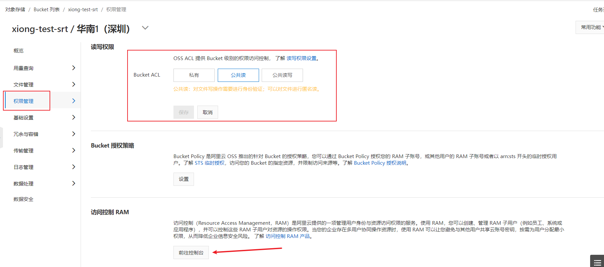

### 5、创建用户并赋予权限

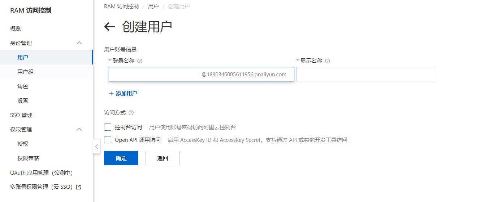

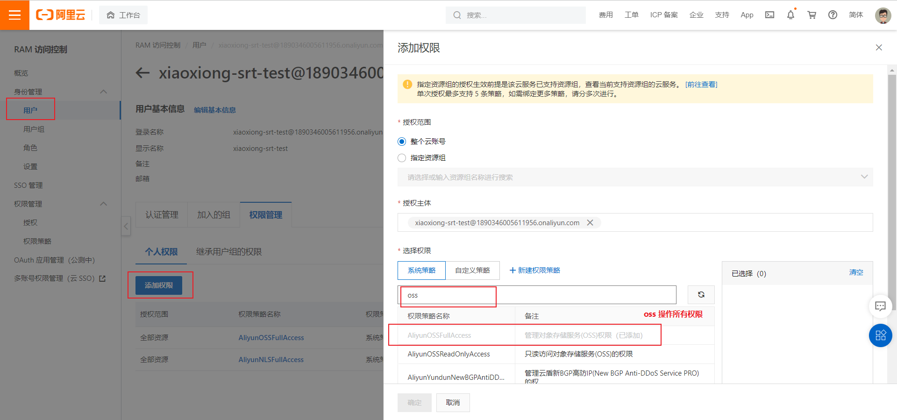

github仓库

https://github.com/aliyun/aliyun-oss-java-sdk/blob/2.8.3/src/samples/ListObjectsSample.java

## SDK示例

https://help.aliyun.com/document_detail/32008.html

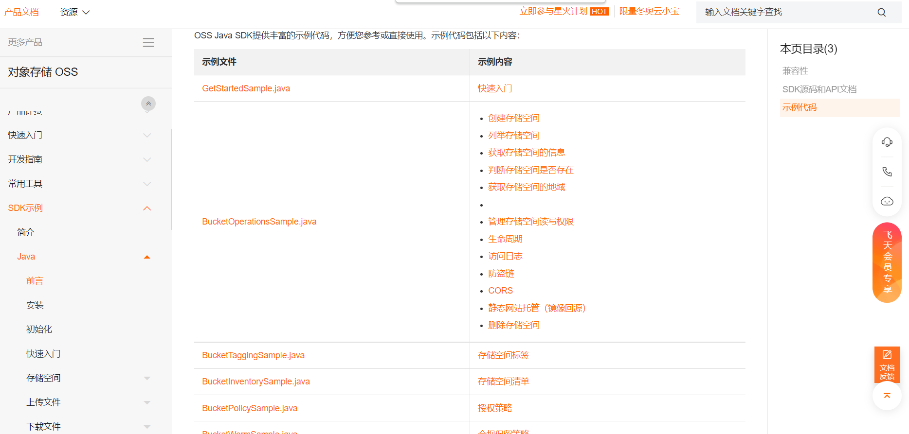

### 快速入门

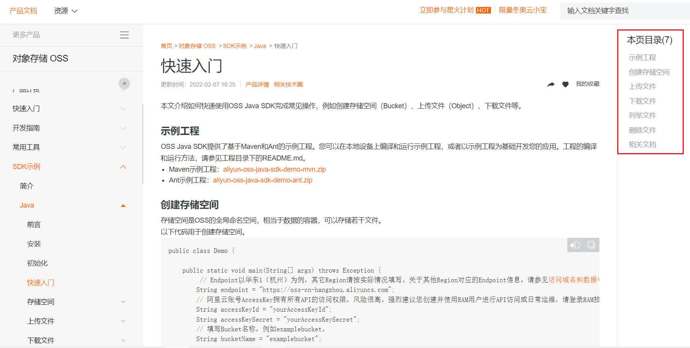

## API

### 在线API文档

https://gosspublic.alicdn.com/AliyunJavaSDK/latest/javadoc/index.html

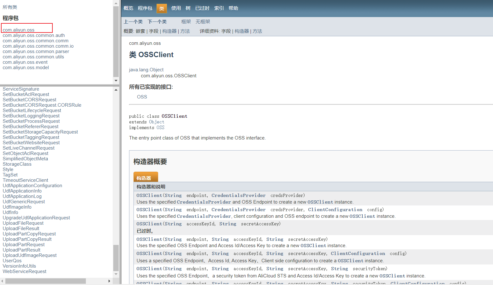

### 下载源码查看接口方法

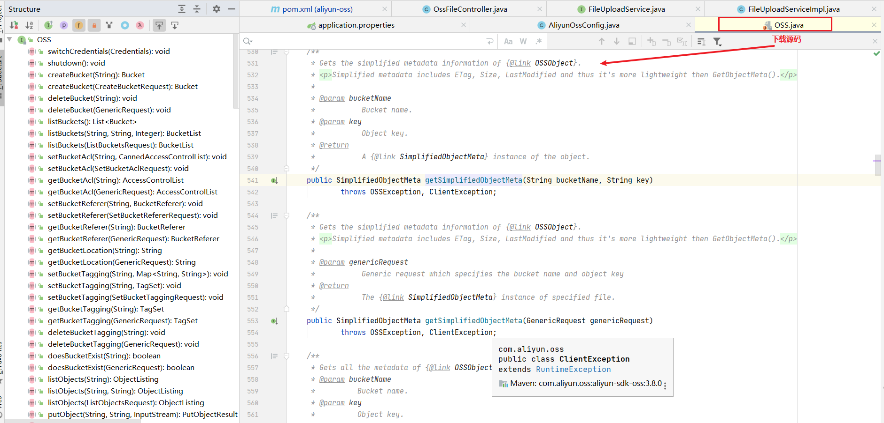