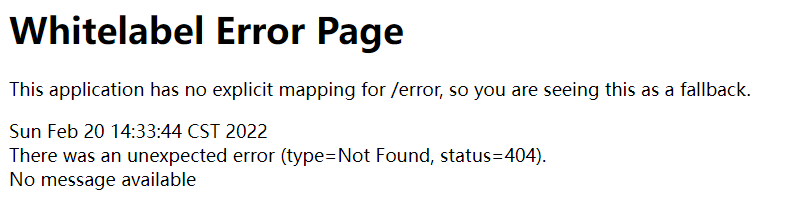
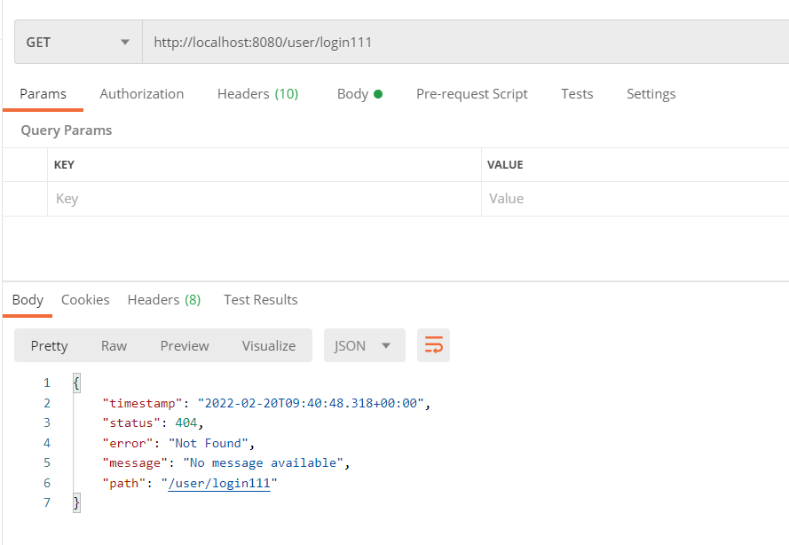
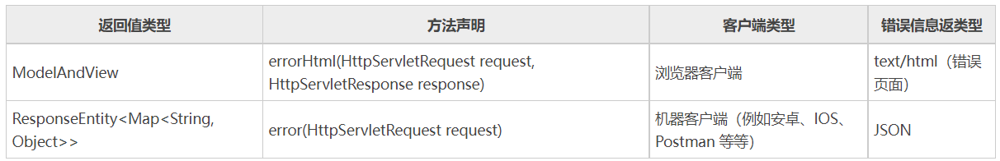
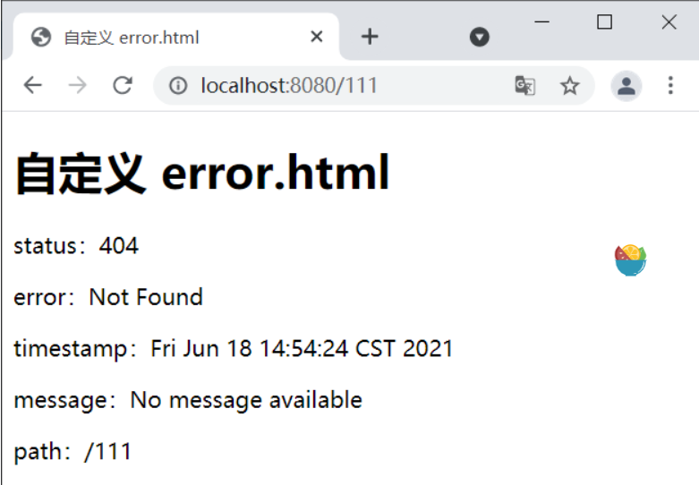
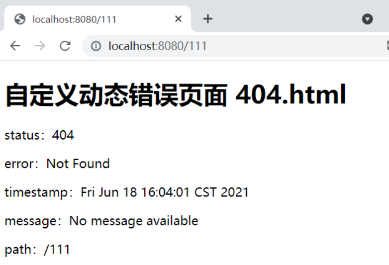
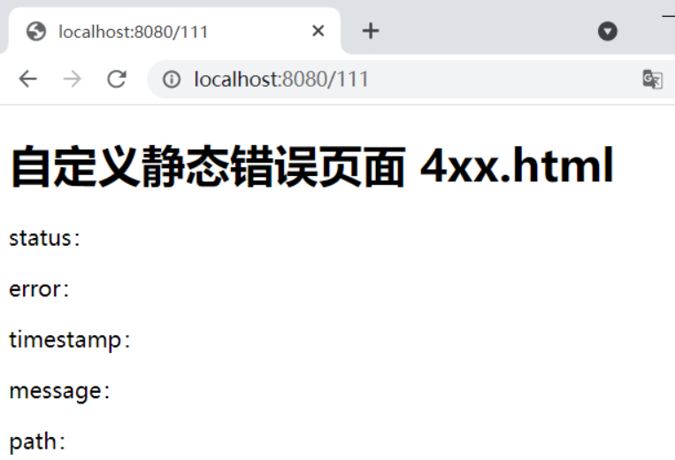
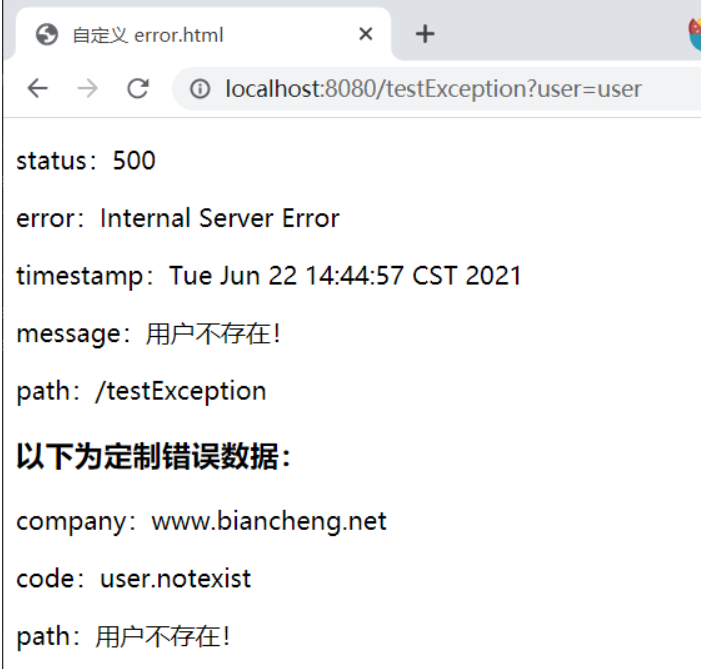

# SpringBoot异常处理

参考：

http://c.biancheng.net/spring_boot/global-exception.html

http://www.zzvips.com/article/99706.html

https://www.yuque.com/coolair/sy/rwwk9g

https://blog.csdn.net/qq_24598601/article/details/89243914

在日常的 Web 开发中，会经常遇到大大小小的异常，此时往往需要一个统一的异常处理机制，来保证客户端能接

收较为友好的提示。Spring Boot 同样提供了一套默认的异常处理机制，本节将对它进行详细的介绍。 

## SpringBoot 默认异常处理机制

 SpringBoot 提供了一套默认的异常处理机制，一旦程序中出现了异常，Spring Boot 会自动识别客户端的类型（浏览器客户端或机器客户端），并根据客户端的不同，以不同的形式展示异常信息。

1、对于浏览器客户端而言，SpringBoot 会响应一个 “ whitelabel ” 错误视图，以 HTML 格式呈现错误信息：



2、对于机器客户端而言，SpringBoot 将生成 JSON 响应，来展示异常消息。 



## SpringBoot 异常处理自动配置原理

SpringBoot 通过配置类 ErrorMvcAutoConfiguration 对异常处理提供了自动配置，该配置类向容器中注入了以下 

4 个组件。

- ErrorPageCustomizer：该组件会在在系统发生异常后，默认将请求转发到“/error”上。
- BasicErrorController：处理默认的“/error”请求。

- DefaultErrorViewResolver：默认的错误视图解析器，将异常信息解析到相应的错误视图上。

- DefaultErrorAttributes：用于页面上共享异常信息。

源码地址

`org.springframework.boot.autoconfigure.web.servlet.error.ErrorMvcAutoConfiguration`


下面，我们依次对这四个组件进行详细的介绍：

### ErrorPageCustomizer

ErrorMvcAutoConfiguration 向容器中注入了一个名为 ErrorPageCustomizer 的组件，它主要用于定制错误页面

的响应规则。

```java
@Bean
public ErrorPageCustomizer errorPageCustomizer(DispatcherServletPath dispatcherServletPath) {
    return new ErrorPageCustomizer(this.serverProperties, dispatcherServletPath);
}
```

ErrorPageCustomizer 通过 registerErrorPages() 方法来注册错误页面的响应规则。当系统中发生异常后，

ErrorPageCustomizer  组件会自动生效，并将请求转发到 “/error”上，交给 BasicErrorController 进行处理，其

部分代码如下。 

```java
@Override
public void registerErrorPages(ErrorPageRegistry errorPageRegistry) {
    //将请求转发到 /errror（this.properties.getError().getPath()）上
    ErrorPage errorPage = new ErrorPage(this.dispatcherServletPath.getRelativePath(this.properties.getError().getPath()));
    // 注册错误页面
    errorPageRegistry.addErrorPages(errorPage);
}
```

### BasicErrorController

ErrorMvcAutoConfiguration 还向容器中注入了一个错误控制器组件 BasicErrorController，代码如下。

```java
@Bean
@ConditionalOnMissingBean(value = ErrorController.class, search = SearchStrategy.CURRENT)
public BasicErrorController basicErrorController(ErrorAttributes errorAttributes,
                                                 ObjectProvider<ErrorViewResolver> errorViewResolvers) {
    return new BasicErrorController(errorAttributes, this.serverProperties.getError(),
            errorViewResolvers.orderedStream().collect(Collectors.toList()));
}
```

 BasicErrorController 的定义如下

```java
//BasicErrorController 用于处理 “/error” 请求
@Controller
@RequestMapping("${server.error.path:${error.path:/error}}")
public class BasicErrorController extends AbstractErrorController {
    ......
    /**
     * 该方法用于处理浏览器客户端的请求发生的异常
     * 生成 html 页面来展示异常信息
     * @param request
     * @param response
     * @return
     */
    @RequestMapping(produces = MediaType.TEXT_HTML_VALUE)
    public ModelAndView errorHtml(HttpServletRequest request, HttpServletResponse response) {
        //获取错误状态码
        HttpStatus status = getStatus(request);
        //getErrorAttributes 根据错误信息来封装一些 model 数据，用于页面显示
        Map<String, Object> model = Collections
                .unmodifiableMap(getErrorAttributes(request, getErrorAttributeOptions(request, MediaType.TEXT_HTML)));
        //为响应对象设置错误状态码
        response.setStatus(status.value());
        //调用 resolveErrorView() 方法，使用错误视图解析器生成 ModelAndView 对象（包含错误页面地址和页面内容）
        ModelAndView modelAndView = resolveErrorView(request, response, status, model);
        return (modelAndView != null) ? modelAndView : new ModelAndView("error", model);
    }
    /**
     * 该方法用于处理机器客户端的请求发生的错误
     * 产生 JSON 格式的数据展示错误信息
     * @param request
     * @return
     */
    @RequestMapping
    public ResponseEntity<Map<String, Object>> error(HttpServletRequest request) {
        HttpStatus status = getStatus(request);
        if (status == HttpStatus.NO_CONTENT) {
            return new ResponseEntity<>(status);
        }
        Map<String, Object> body = getErrorAttributes(request, getErrorAttributeOptions(request, MediaType.ALL));
        return new ResponseEntity<>(body, status);
    }
    ......
}
```

 Spring Boot 通过 BasicErrorController 进行统一的错误处理（例如默认的“/error”请求）。Spring Boot 会自动识别发出请求的客户端的类型（浏览器客户端或机器客户端），并根据客户端类型，将请求分别交给 errorHtml() 和 error() 方法进行处理。 



> 当使用浏览器访问出现异常时，会进入 BasicErrorController 控制器中的 errorHtml() 方法进行处理，
>
> 当使用安卓、IOS、Postman 等机器客户端访问出现异常时，就进入error() 方法处理。 

 在 errorHtml() 方法中会调用父类（AbstractErrorController）的 resolveErrorView() 方法，代码如下 

```java
protected ModelAndView resolveErrorView(HttpServletRequest request, HttpServletResponse response, HttpStatus status,
                                        Map<String, Object> model) {
    //获取容器中的所有的错误视图解析器来处理该异常信息
    for (ErrorViewResolver resolver : this.errorViewResolvers) {
        //调用错误视图解析器的 resolveErrorView 解析到错误视图页面
        ModelAndView modelAndView = resolver.resolveErrorView(request, status, model);
        if (modelAndView != null) {
            return modelAndView;
        }
    }
    return null;
}
```

从上述源码可以看出，在响应页面的时候，会在父类的 resolveErrorView 方法中获取容器中所有的 

ErrorViewResolver 对象（错误视图解析器，包括 DefaultErrorViewResolver 在内），一起来解析异常信息。

ErrorMvcAutoConfiguration 还向容器中注入了一个默认的错误视图解析器组件 DefaultErrorViewResolver，代

码如下

```java
@Bean
@ConditionalOnBean(DispatcherServlet.class)
@ConditionalOnMissingBean(ErrorViewResolver.class)
DefaultErrorViewResolver conventionErrorViewResolver() {
    return new DefaultErrorViewResolver(this.applicationContext, this.resources);
}
```

 当发出请求的客户端为浏览器时，Spring Boot 会获取容器中所有的 ErrorViewResolver 对象（错误视图解析器），并分别调用它们的 resolveErrorView() 方法对异常信息进行解析，其中自然也包括 DefaultErrorViewResolver（默认错误信息解析器）。

DefaultErrorViewResolver 的部分代码如下

```java
public class DefaultErrorViewResolver implements ErrorViewResolver, Ordered {
    private static final Map<HttpStatus.Series, String> SERIES_VIEWS;
    static {
        Map<HttpStatus.Series, String> views = new EnumMap<>(HttpStatus.Series.class);
        views.put(Series.CLIENT_ERROR, "4xx");
        views.put(Series.SERVER_ERROR, "5xx");
        SERIES_VIEWS = Collections.unmodifiableMap(views);
    }
    ......
    @Override
    public ModelAndView resolveErrorView(HttpServletRequest request, HttpStatus status, Map<String, Object> model) {
        //尝试以错误状态码作为错误页面名进行解析
        ModelAndView modelAndView = resolve(String.valueOf(status.value()), model);
        if (modelAndView == null && SERIES_VIEWS.containsKey(status.series())) {
            //尝试以 4xx 或 5xx 作为错误页面页面进行解析
            modelAndView = resolve(SERIES_VIEWS.get(status.series()), model);
        }
        return modelAndView;
    }
    private ModelAndView resolve(String viewName, Map<String, Object> model) {
        //错误模板页面，例如 error/404、error/4xx、error/500、error/5xx
        String errorViewName = "error/" + viewName;
        //当模板引擎可以解析这些模板页面时，就用模板引擎解析
        TemplateAvailabilityProvider provider = this.templateAvailabilityProviders.getProvider(errorViewName,
                this.applicationContext);
        if (provider != null) {
            //在模板能够解析到模板页面的情况下，返回 errorViewName 指定的视图
            return new ModelAndView(errorViewName, model);
        }
        //若模板引擎不能解析，则去静态资源文件夹下查找 errorViewName 对应的页面
        return resolveResource(errorViewName, model);
    }
    private ModelAndView resolveResource(String viewName, Map<String, Object> model) {
        //遍历所有静态资源文件夹
        for (String location : this.resources.getStaticLocations()) {
            try {
                Resource resource = this.applicationContext.getResource(location);
                //静态资源文件夹下的错误页面，例如error/404.html、error/4xx.html、error/500.html、error/5xx.html
                resource = resource.createRelative(viewName + ".html");
                //若静态资源文件夹下存在以上错误页面，则直接返回
                if (resource.exists()) {
                    return new ModelAndView(new DefaultErrorViewResolver.HtmlResourceView(resource), model);
                }
            } catch (Exception ex) {
            }
        }
        return null;
    }
    ......
}
```

DefaultErrorViewResolver 解析异常信息的步骤如下：

1. 根据错误状态码（例如 404、500、400 等），生成一个错误视图 error/status，例如 error/404、error/500、error/400。
2. 尝试使用模板引擎解析 error/status 视图，即尝试从 classpath 类路径下的 templates 目录下，查找 error/status.html，例如 error/404.html、error/500.html、error/400.html。
3. 若模板引擎能够解析到 error/status 视图，则将视图和数据封装成 ModelAndView 返回并结束整个解析流程，否则跳转到第 4 步。
4. 依次从各个静态资源文件夹中查找 error/status.html，若在静态文件夹中找到了该错误页面，则返回并结束整个解析流程，否则跳转到第 5 步。
5. 将错误状态码（例如 404、500、400 等）转换为 4xx 或 5xx，然后重复前 4 个步骤，若解析成功则返回并结束整个解析流程，否则跳转第 6 步。 
6. 处理默认的 “/error ”请求，使用 Spring Boot 默认的错误页面（Whitelabel Error Page）。

### DefaultErrorAttributes

ErrorMvcAutoConfiguration 还向容器中注入了一个组件默认错误属性处理工具 DefaultErrorAttributes，代码如

下。

```java
@Bean
@ConditionalOnMissingBean(value = ErrorAttributes.class, search = SearchStrategy.CURRENT)
public DefaultErrorAttributes errorAttributes() {
    return new DefaultErrorAttributes();
}
```

 DefaultErrorAttributes 是 Spring Boot 的默认错误属性处理工具，它可以从请求中获取异常或错误信息，并将其封装为一个 Map 对象返回，其部分代码如下。 

```java
public class DefaultErrorAttributes implements ErrorAttributes, HandlerExceptionResolver, Ordered {
    ......
    @Override
    public Map<String, Object> getErrorAttributes(WebRequest webRequest, ErrorAttributeOptions options) {
        Map<String, Object> errorAttributes = getErrorAttributes(webRequest, options.isIncluded(Include.STACK_TRACE));
        if (!options.isIncluded(Include.EXCEPTION)) {
            errorAttributes.remove("exception");
        }
        if (!options.isIncluded(Include.STACK_TRACE)) {
            errorAttributes.remove("trace");
        }
        if (!options.isIncluded(Include.MESSAGE) && errorAttributes.get("message") != null) {
            errorAttributes.remove("message");
        }
        if (!options.isIncluded(Include.BINDING_ERRORS)) {
            errorAttributes.remove("errors");
        }
        return errorAttributes;
    }
    private Map<String, Object> getErrorAttributes(WebRequest webRequest, boolean includeStackTrace) {
        Map<String, Object> errorAttributes = new LinkedHashMap<>();
        errorAttributes.put("timestamp", new Date());
        addStatus(errorAttributes, webRequest);
        addErrorDetails(errorAttributes, webRequest, includeStackTrace);
        addPath(errorAttributes, webRequest);
        return errorAttributes;
    }
    ......
}
```

在 Spring Boot 默认的 Error 控制器（BasicErrorController）处理错误时，会调用 DefaultErrorAttributes 的 getErrorAttributes() 方法获取错误或异常信息，并封装成 model 数据（Map 对象），返回到页面或 JSON 数据中。该 model 数据主要包含以下属性：

- timestamp：时间戳；
- status：错误状态码
- error：错误的提示
- exception：导致请求处理失败的异常对象
- message：错误/异常消息
- trace： 错误/异常栈信息
- path:错误/异常抛出时所请求的URL路径

>  所有通过 DefaultErrorAttributes 封装到 model 数据中的属性，都可以直接在页面或 JSON 中获取。 

## 自定义异常

### 定制错误页面

默认返回的错误页面太丑了，如何自定义一个呢？

看源码：


error.html默认是全局异常都展示的页面

如何更加细致的展示错误呢？如URL输入错误页面找不到展示404.html    服务器错误展示500.html


我们可以通过以下 3 种方式定制 Spring Boot 错误页面：

- 自定义 error.html
- 自定义动态错误页面
- 自定义静态错误页面

#### 自定义error.html

我们可以直接在模板引擎文件夹（/resources/templates）下创建 error.html ，覆盖 Spring Boot 默认的错误视

图页面（Whitelabel Error Page）。

示例 1

1、在 spring-boot-adminex 的模板引擎文件夹（classpath:/resources/templates）下，创建一个 error.html，代码如下。

```html
<!DOCTYPE html>
<html lang="en" xmlns:th="http://www.thymeleaf.org">
<head>
    <meta charset="UTF-8">
    <title>自定义 error.html</title>
</head>
<body>
<h1>自定义 error.html</h1>
<p>status：<span th:text="${status}"></span></p>
<p>error：<span th:text="${error}"></span></p>
<p>timestamp：<span th:text="${timestamp}"></span></p>
<p>message：<span th:text="${message}"></span></p>
<p>path：<span th:text="${path}"></span></p>
</body>
</html>
```

2、启动 Spring Boot，在完成登陆跳转到主页后，使用浏览器地访问“http://localhost:8080/111”，结果如下图 



由图 1 可以看出，Spring Boot 使用了我们自定义的 error.html 覆盖了默认的错误视图页面（Whitelabel Error Page）。

#### 自定义动态错误页面

如果 Sprng Boot 项目使用了模板引擎，当程序发生异常时，Spring Boot 的默认错误视图解析器（DefaultErrorViewResolver）就会解析模板引擎文件夹（resources/templates/）下 error 目录中的错误视图页面。

**精确匹配**

我们可以根据错误状态码（例如 404、500、400 等等）的不同，分别创建不同的动态错误页面（例如 404.html、500.html、400.html 等等），并将它们存放在模板引擎文件夹下的 error 目录中。当发生异常时，Spring Boot 会根据其错误状态码精确匹配到对应的错误页面上。

**示例 2**

1、在 spring-boot-adminex 的模板引擎文件夹下 error 目录中，创建一个名为 404.html 的错误页面，代码如下。

```html
<!DOCTYPE html>
<html lang="en" xmlns:th="http://www.thymeleaf.org">
<head>
    <meta charset="UTF-8">
    <title></title>
</head>
<body>
<h1>自定义动态错误页面 404.html</h1>
<p>status：<span th:text="${status}"></span></p>
<p>error：<span th:text="${error}"></span></p>
<p>timestamp：<span th:text="${timestamp}"></span></p>
<p>message：<span th:text="${message}"></span></p>
<p>path：<span th:text="${path}"></span></p>
</body>
</html>
```

2、启动 Spring Boot，在完成登陆跳转到主页后，在浏览器地址栏输入“http://localhost:8080/111”，结果如下图。 



**模糊匹配**

我们还可以使用 4xx.html 和 5xx.html 作为动态错误页面的文件名，并将它们存放在模板引擎文件夹下的 error 目录中，来模糊匹配对应类型的所有错误，例如 404、400 等错误状态码以“4”开头的所有异常，都会解析到动态错误页面 4xx.html 上。

**示例 3**

在 spring-boot-adminex 的模板引擎文件夹下 error 目录中，创建一个名为 4xx.html 的错误页面，代码如下。

```html
<!DOCTYPE html>
<html lang="en" xmlns:th="http://www.thymeleaf.org">
<head>
    <meta charset="UTF-8">
    <title></title>
</head>
<body>
<h1>自定义动态错误页面 4xx.html</h1>
<p>status：<span th:text="${status}"></span></p>
<p>error：<span th:text="${error}"></span></p>
<p>timestamp：<span th:text="${timestamp}"></span></p>
<p>message：<span th:text="${message}"></span></p>
<p>path：<span th:text="${path}"></span></p>
</body>
</html>
```

2、启动 Spring Boot，在完成登陆跳转到主页后，使用浏览器访问“http://localhost:8080/111”，结果如下图。



### 错误页面优先级

以上 5 种方式均可以定制 Spring Boot 错误页面，且它们的优先级顺序为：自定义动态错误页面（精确匹配）>自定义静态错误页面（精确匹配）>自定义动态错误页面（模糊匹配）>自定义静态错误页面（模糊匹配）>自定义 error.html

>  当遇到错误时，Spring Boot 会按照优先级由高到低，依次查找解析错误页，一旦找到可用的错误页面，则直接返回客户端展示。 

### 定制错误数据

我们知道，Spring Boot 提供了一套默认的异常处理机制，其主要流程如下：

1. 发生异常时，将请求转发到“/error”，交由 BasicErrorController（Spring Boot 默认的 Error 控制器） 进行处理；
2. BasicErrorController 根据客户端的不同，自动适配返回的响应形式，浏览器客户端返回错误页面，机器客户端返回 JSON 数据。
3. BasicErrorController 处理异常时，会调用 DefaultErrorAttributes（默认的错误属性处理工具） 的 getErrorAttributes() 方法获取错误数据。
   我们还可以定制 Spring Boot 的错误数据，具体步骤如下。

#### 1. 自定义异常处理类

被 @ControllerAdvice 注解的类可以用来实现全局异常处理，这是 Spring MVC 中提供的功能，在 Spring Boot 中可以直接使用。
1）在 net.biancheng.net.exception 包内，创建一个名为 UserNotExistException 的异常类，代码如下。

```java
package net.biancheng.www.exception;
/**
* 自定义异常
*/
public class UserNotExistException extends RuntimeException {
    public UserNotExistException() {
        super("用户不存在！");
    }
}
```

 2）在 IndexController 添加以下方法，触发 UserNotExistException 异常，代码如下。 

```java
@Controller
public class IndexController {
    ......
    @GetMapping(value = {"/testException"})
    public String testException(String user) {
        if ("user".equals(user)) {
            throw new UserNotExistException();
        }
        //跳转到登录页 login.html
        return "login";
    }
}
```

 3）在 net.biancheng.www.controller 中，创建一个名为 MyExceptionHandler 异常处理类，代码如下。 

```java
package net.biancheng.www.controller;
import net.biancheng.www.exception.UserNotExistException;
import org.springframework.web.bind.annotation.ControllerAdvice;
import org.springframework.web.bind.annotation.ExceptionHandler;
import javax.servlet.http.HttpServletRequest;
import java.util.HashMap;
import java.util.Map;
@ControllerAdvice
public class MyExceptionHandler {
    @ExceptionHandler(UserNotExistException.class)
    public String handleException(Exception e, HttpServletRequest request) {
        Map<String, Object> map = new HashMap<>();
        //向 request 对象传入错误状态码
        request.setAttribute("javax.servlet.error.status_code",500);
        //根据当前处理的异常，自定义的错误数据
        map.put("code", "user.notexist");
        map.put("message", e.getMessage());
        //将自定的错误数据传入 request 域中
        request.setAttribute("ext",map);
        return "forward:/error";
    }
}
```

#### 2. 自定义错误属性处理工具

1）在 net.biancheng.www.componet 包内，创建一个错误属性处理工具类 MyErrorAttributes（继承 DefaultErrorAttributes ），通过该类我们便可以添加自定义的错误数据，代码如下。

```java
package net.biancheng.www.componet;
import org.springframework.boot.web.error.ErrorAttributeOptions;
import org.springframework.boot.web.servlet.error.DefaultErrorAttributes;
import org.springframework.stereotype.Component;
import org.springframework.web.context.request.WebRequest;
import java.util.Map;
//向容器中添加自定义的储物属性处理工具
@Component
public class MyErrorAttributes extends DefaultErrorAttributes {
    @Override
    public Map<String, Object> getErrorAttributes(WebRequest webRequest, ErrorAttributeOptions options) {
        Map<String, Object> errorAttributes = super.getErrorAttributes(webRequest, options);
        //添加自定义的错误数据
        errorAttributes.put("company", "www.biancheng.net");
        //获取 MyExceptionHandler 传入 request 域中的错误数据
        Map ext = (Map) webRequest.getAttribute("ext", 0);
        errorAttributes.put("ext", ext);
        return errorAttributes;
    }
}

```

 2）在 templates/error 目录下，创建动态错误页面 5xx.html，代码如下。 

```html
<!DOCTYPE html>
<html lang="en" xmlns:th="http://www.thymeleaf.org">
<head>
    <meta charset="UTF-8">
    <title>自定义 error.html</title>
</head>
<body>
<p>status：<span th:text="${status}"></span></p>
<p>error：<span th:text="${error}"></span></p>
<p>timestamp：<span th:text="${timestamp}"></span></p>
<p>message：<span th:text="${message}"></span></p>
<p>path：<span th:text="${path}"></span></p>
<!--取出定制的错误信息-->
<h3>以下为定制错误数据：</h3>
<p>company：<span th:text="${company}"></span></p>
<p>code：<span th:text="${ext.code}"></span></p>
<p>path：<span th:text="${ext.message}"></span></p>
</body>
</html>
```

 3）启动 Spring Boot，访问“http://localhost:8080/testException?user=user”，结果如下图。 




1.在有模板引擎的情况下：

springboot会默认找 templates/error/错误状态码.html，所以我们要定制化错误页面就可以到templates/error下创建一个【对应错误状态码.html】html文件，当发生此状态码的错误springboot就会来到对应的页面。

同时如果我们想让400-499之间的错误都去同一个错误页面，那我们可以在templates/error下创建一个4xx.html。同理500-599的错误可以用5xx.html。


注意：springboot会优先匹配具体的【错误状态码.html】，然后再匹配4xx,5xx的。例如：发生了404错误，springboot优先到templates/error下找404.html，如果没有404.html，再找有没有4xx.html，有的话就会使用4xx.html。

在错误页面我们能够获取到的信息：

-  timestamp：时间戳
-  status：状态码
-  error：错误提示
-  exception：异常对象 springboot2.1.6在页面获取异常对象要现在全局配置文件中加入：server.error.include-exception=true
-  message：异常消息
-  errors：JSR数据校验的错误

2.在没有模板引擎（模板引擎找不到这个错误页面）的情况下，springboot会到静态资源文件夹下的error包下找。

3.以上都没有找到错误页面，就默认用springboot默认的错误提示页面

错误异常处理——自定义响应json数据

上边的错误处理中，如果是浏览器访问可以响应我们自己定制的错误页面，但是如果是其他客户端访问，则只会响应固定的json数据