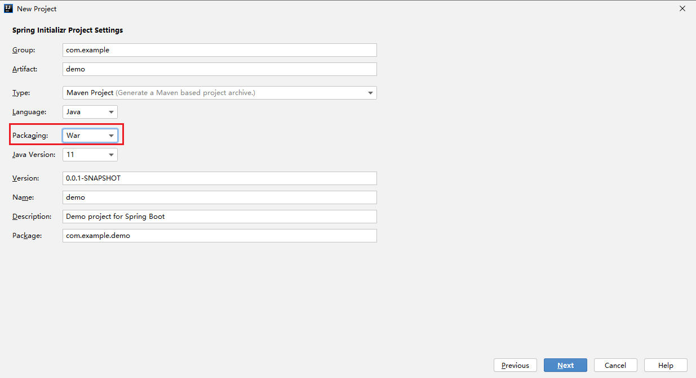
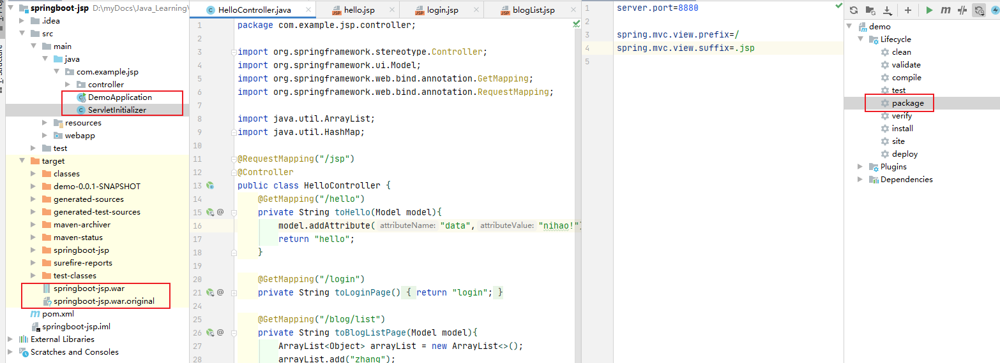
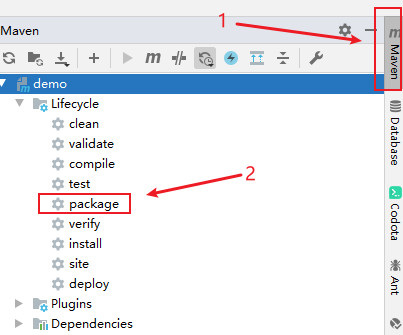
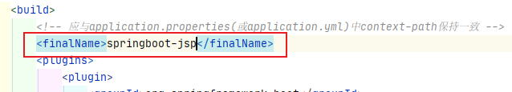
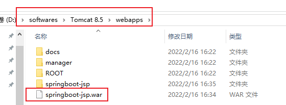

# Springboot打War包并部署

## jar包和war包的介绍和区别

https://www.jianshu.com/p/3b5c45e8e5bd

## 打包及部署步骤

### 1、使用IEDA创建项目



将打包方式改为War，会在创建项目时生成ServletInitializer.java



### 2、继承SpringBootServletInitializer

继承org.springframework.boot.web.servlet.support.SpringBootServletInitializer，重写configure方法

为什么继承该类，SpringBootServletInitializer源码注释：

> ```
> Note that a WebApplicationInitializer is only needed if you are building a war file and
> deploying it. If you prefer to run an embedded web server then you won't need this at all.
> ```
>
> 请注意，WebApplicationInitializer 仅在您构建 war 文件并部署它时才需要。如果您更喜欢运行嵌入式 Web 服务器，那么您根本不需要它
>
> 总结：tomcat启动是自动启动 /webapps/xxx.war

方式一、启动类继承SpringBootServletInitializer重写configure方法：

```java
@SpringBootApplication
public class Application extends SpringBootServletInitializer {

    public static void main(String[] args) {
        SpringApplication.run(Application.class, args);
    }

    @Override
    protected SpringApplicationBuilder configure(SpringApplicationBuilder builder) {
        return builder.sources(Application.class);
    }
}
```

方式二、新增加一个类继承SpringBootServletInitializer重写configure：

```java
public class ServletInitializer extends SpringBootServletInitializer {
    @Override
    protected SpringApplicationBuilder configure(SpringApplicationBuilder builder) {
        //此处的Application.class为带有@SpringBootApplication注解的启动类
        return builder.sources(DemoApplication.class);
    }
}
```

### 3、打包&部署

1、使用IDEA的Maven打包工具



**注意：**

> 使用外部Tomcat部署访问的时候，application.properties(或者application.yml)中配置的
>
> ```shell
> server.port=8888
> server.servlet.context-path=/springboot-jsp
> ```
>
> 将失效，请使用tomcat的端口，tomcat，webapps下项目名进行访问。
>
> 为了防止应用上下文所导致的项目访问资源加载不到的问题，建议pom.xml文件中`<build></build>`标签下添加`<finalName></finalName>`标签：
>
> 
>
> 使用IDEA的maven打包工具会将项目打包生成为： /tragetspringboot-jsp.war

2、将war包拷贝到tomcat服务器的webapps目录下，运行/bin/startup.bat



3、浏览器中输入：

`http://localhost:[tomcat端口]/[war包名]/[访问路径]`

例如：

http://localhost:8080/springboot-jsp/jsp/blog/list